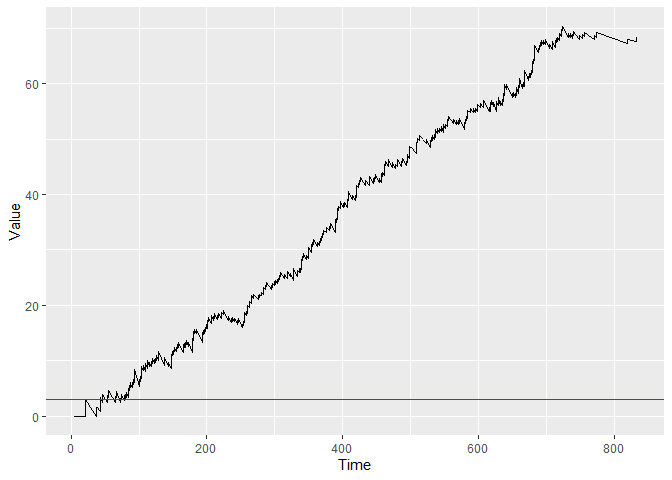

<!-- README.md is generated from README.Rmd. Please edit that file -->

# success

<!-- badges: start -->
<!-- badges: end -->

The goal of the success package is to allow easy applications of
continuous time CUSUM procedures on survival data. Specifically, the
Biswas & Kalbfleisch CUSUM (2008) and the CGR-CUSUM (2021).

Besides this, it allows for the construction of the Binary CUSUM chart
and funnel plot on survival data as well.

## Installation

You can install the released version of success from
[CRAN](https://CRAN.R-project.org) with:

``` r
install.packages("success")
```

And the development version from [GitHub](https://github.com/) with:

``` r
# install.packages("devtools")
devtools::install_github("d-gomon/success")
```

## Example

This is a basic example which shows you how to construct a CGR-CUSUM
chart on a hospital from the attached data set “surgerydat”:

``` r
library(success)
#> Loading required package: ggplot2
#> Loading required package: pbapply
#> Warning: package 'pbapply' was built under R version 4.1.2
library(survival)
tdat <- subset(surgerydat, hosp_num == 1)
tcbaseh <- function(t) chaz_exp(t, lambda = 0.01)

exprfit <- as.formula("Surv(survtime, censorid) ~ age + sex + BMI" )
tcoxmod <- coxph(exprfit, data= surgerydat)

#Alternatively, cbaseh can be left empty when specifying coxphmod through coxph()
cgr <- cgr_cusum(data = tdat, coxphmod = tcoxmod, cbaseh = tcbaseh, pb = TRUE)
#> Step 1/2: Determining hazard contributions.
#> Step 2/2: Determining chart values.
plot(cgr)
```


You can plot the figure with control limit *h* = 3 by using:

``` r
plot(cgr, h = 3)
```



And determine the runlength of the chart when using control limit
*h* = 4:

``` r
runlength(cgr, h = 4)
#> [1] 102
```

Hospital 1 would be detected by a CGR-CUSUM with control limit *h* = 4
after 102 days.

Alternatively, you can construct the CGR-CUSUM only until it crosses
control limit *h* = 3 by:

``` r
cgr <- cgr_cusum(data = tdat, coxphmod = tcoxmod, cbaseh = tcbaseh, pb = TRUE, h = 3)
#> Step 1/2: Determining hazard contributions.
#> Step 2/2: Determining chart values.
plot(cgr)
```


