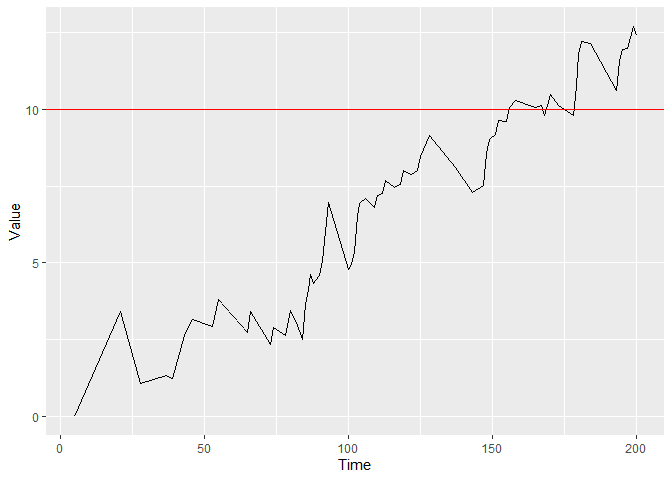
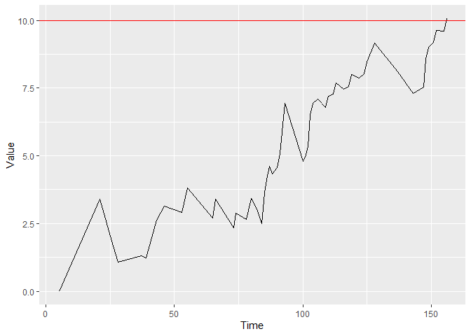

<!-- README.md is generated from README.Rmd. Please edit that file -->

# success

<!-- badges: start -->
<!-- badges: end -->

The goal of the package is to allow easy applications of continuous time
CUSUM procedures on survival data. Specifically, the Biswas &
Kalbfleisch CUSUM (2008) and the CGR-CUSUM (2021).

Besides this, it allows for the construction of the Binary CUSUM chart
and funnel plot on survival data as well.

## Installation

You can install the released version of success from
[CRAN](https://CRAN.R-project.org) with:

``` r
install.packages("success")
```

And the development version from [GitHub](https://github.com/) with:

``` r
# install.packages("devtools")
devtools::install_github("d-gomon/success")
```

## CGR-CUSUM Example

This is a basic example which shows you how to construct a CGR-CUSUM
chart on a hospital from the attached data set “surgerydat”:

``` r
dat <- subset(surgerydat, unit == 1)
exprfit <- as.formula("Surv(survtime, censorid) ~ age + sex + BMI")
tcoxmod <- coxph(exprfit, data = surgerydat)

cgr <- cgr_cusum(data = dat, coxphmod = tcoxmod, stoptime = 200)
plot(cgr)
```


You can plot the figure with control limit *h* = 10 by using:

``` r
plot(cgr, h = 10)
```



And determine the runlength of the chart when using control limit
*h* = 10:

``` r
runlength(cgr, h = 10)
#> [1] 151
```

Hospital 1 would be detected by a CGR-CUSUM with control limit *h* = 10
after 151 days.

Alternatively, you can construct the CGR-CUSUM only until it crosses
control limit *h* = 10 by:

``` r
cgr <- cgr_cusum(data = dat, coxphmod = tcoxmod, h = 10)
plot(cgr)
```



## References

The theory behind the methods in this package can be found in:

Gomon D., Putter H., Nelissen R.G.H.H., van der Pas S (2022):
[CGR-CUSUM: A Continuous time Generalized Rapid Response Cumulative Sum
chart](https://doi.org/10.48550/arXiv.2205.07618), *arXiv: a preprint*
