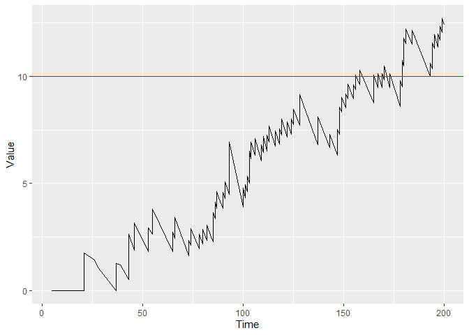

<!-- README.md is generated from README.Rmd. Please edit that file -->

# success 

<!-- badges: start -->

[](https://lifecycle.r-lib.org/articles/stages.html)
[](https://www.repostatus.org/#active)
[](https://github.com/d-gomon/success/actions/)
[](https://CRAN.R-project.org/package=success)
[](https://cran.r-project.org/package=success)
[](https://github.com/d-gomon/success)
[](https://doi.org/10.1093/biostatistics/kxac041)
<!-- badges: end -->

<!-- [](https://doi.org/10.48550/arXiv.2205.07618) -->

# SUrvival Control Chart EStimation Software

The goal of the package is to allow easy applications of continuous time
CUSUM procedures on survival data. Specifically, the Biswas &
Kalbfleisch CUSUM (2008) and the CGR-CUSUM (Gomon et al. 2022).

Besides continuous time procedures, it is also possible to construct the
Bernoulli (binary) CUSUM and funnel plot (Spiegelhalter 2005) on
survival data.

## Installation

You can install the released version of success from
[CRAN](https://CRAN.R-project.org) with:

``` r
install.packages("success")
```

And the development version from [GitHub](https://github.com/) with:

``` r
# install.packages("devtools")
devtools::install_github("d-gomon/success")
```

## CGR-CUSUM Example

This is a basic example which shows you how to construct a CGR-CUSUM
chart on a hospital from the attached data set “surgerydat”:

``` r
dat <- subset(surgerydat, unit == 1)
exprfit <- as.formula("Surv(survtime, censorid) ~ age + sex + BMI")
tcoxmod <- coxph(exprfit, data = surgerydat)

cgr <- cgr_cusum(data = dat, coxphmod = tcoxmod, stoptime = 200)
plot(cgr)
```


You can plot the figure with control limit `h = 10` by using:

``` r
plot(cgr, h = 10)
```



And determine the runlength of the chart when using control limit
`h = 10`:

``` r
runlength(cgr, h = 10)
#> [1] 151
```

Using a control limit of `h = 10` Hospital 1 would be detected by a
CGR-CUSUM 151 days after the first patient entered the study.

## References

Gomon D., Putter H., Nelissen R.G.H.H., van der Pas S (2022):
[CGR-CUSUM: A Continuous time Generalized Rapid Response Cumulative Sum
chart](https://doi.org/10.1093/biostatistics/kxac041), *Biostatistics*

Biswas P. and Kalbfleisch J.D. (2008): [A risk-adjusted CUSUM in
continuous time based on the Cox
model](https://doi.org/10.1002/sim.3216), *Statistics in Medicine*

Spiegelhalter D.J. (2005): [Funnel plots for comparing institutional
performance](https://doi.org/10.1002/sim.1970), *Statistics in Medicine*
